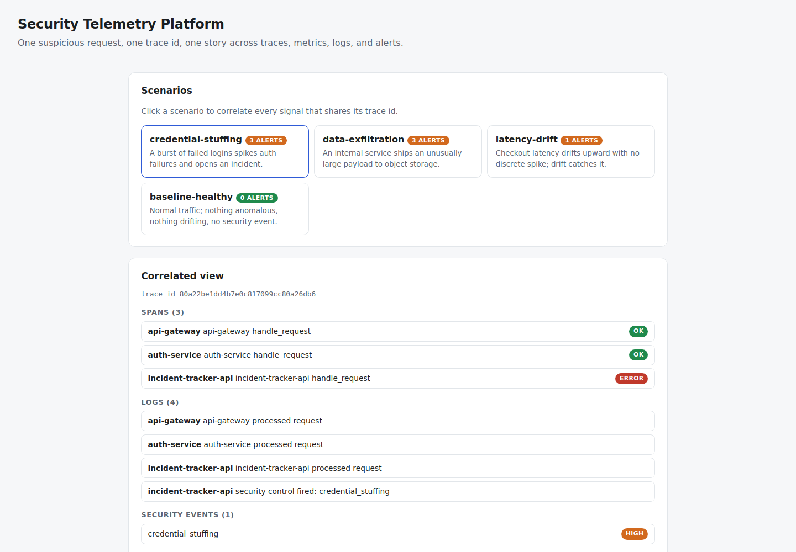

# Security Telemetry Platform

**OpenTelemetry, pointed at security. Give every security signal the same trace
context as the request that caused it, and one suspicious request becomes one
story — the ingress span, the metric that spiked, the audit logs, and the alert
all resolve to a single `trace_id` instead of four disconnected tools.**

[](https://github.com/Vincent-P-essy/security-telemetry-platform/actions/workflows/ci.yml)
[](pyproject.toml)
[](LICENSE)

Most projects emit logs. This one builds the security-observability layer on top
of the OpenTelemetry data model: traces, metrics, and logs in the real OTel
vocabulary, plus security events, all keyed by trace id. On that foundation it
runs robust anomaly detection, behavioral-drift detection, trace correlation, and
alerting — and exports the same telemetry to Prometheus, Jaeger, and Loki in the
exact formats those backends accept.

The engine is deterministic: the same telemetry always yields the same
correlations and alerts, so a run is reproducible evidence. It is a
portfolio-grade prototype over synthetic telemetry, not a production observability
platform.

## Running example



The credential-stuffing scenario: correlated traces, application logs and security alerts from the bundled synthetic environment. [Commands and test results](docs/verification.md).

## Measured evidence

| Measurement | Reviewed result | Scope |
|---|---:|---|
| Scenarios reproducing reviewed correlation | **4/4** | Counts vs `fixtures/ground-truth.json` |
| Incidents fully correlated | **2/2** | Every signal resolves to one trace id |
| Determinism across 200 passes | **1 identical outcome hash** | Trace ids, alert ids, counts all stable |
| Exporters valid | **Prometheus + Jaeger + Loki** | Real payload shapes for every scenario |
| Drift catches what spikes miss | **yes** | `latency-drift`: 0 anomalies, 1 drift alert |
| Test coverage | **93.23%** | Branch-aware source coverage |

See the [methodology](docs/METHODOLOGY.md) and [reviewed reference run](benchmarks/reference/README.md).

## The correlation payoff

A credential-stuffing burst produces a single trace threaded through
`api-gateway → auth-service → incident-tracker-api`. On that one `trace_id` the
platform assembles:

- the **spans** of the request path (with the failing span marked `error`),
- the **metric** series `auth_failures_total` that spiked (anomaly detected),
- the **audit logs** each carrying the trace id,
- the **security event** the control raised,
- and the **alerts** fused from all three sources.

That is the whole point of instrumenting security signals with trace context —
one query, one story, instead of pivoting across a SIEM, a tracer, a metrics
store, and a log store.

## What is implemented

- **OpenTelemetry data model** (`models.py`): trace/span ids, span kind and
  status, metric instruments, log severity — real enough that the exporters emit
  genuine backend payloads.
- **Robust anomaly detection** (`anomaly.py`): the Iglewicz-Hoaglin modified
  z-score (median + MAD), which a single spike cannot hide inside, and which
  survives a flat, zero-MAD series.
- **Behavioral-drift detection** (`drift.py`): Population Stability Index over
  Laplace-smoothed, sample-sized bins, catching a slow distribution shift that
  never trips a point threshold.
- **Correlation** (`correlation.py`): every span, log, security event, metric, and
  alert sharing a trace id assembled into one view.
- **Alerting** (`alerting.py`): anomalies, drift, and security events fused into
  deduplicated, severity-ranked alerts that keep their trace id.
- **Exporters** (`exporters.py`): Prometheus text exposition, a Jaeger trace
  document, and a Loki push payload.
- CLI, local API, dependency-free dashboard, JSON/Markdown reports, Docker, CI,
  and a deterministic benchmark.

## The four scenarios

| Scenario | Anomaly | Drift | Security | What it shows |
|---|:---:|:---:|:---:|---|
| `credential-stuffing` | ✓ | ✓ | ✓ | full incident correlated on one trace |
| `data-exfiltration` | ✓ | ✓ | ✓ | large egress spike + drift + event |
| `latency-drift` | — | ✓ | — | drift catches a shift with no spike |
| `baseline-healthy` | — | — | — | normal traffic raises zero alerts |

## Quick start

Requirements: Python 3.11 or 3.12 and [`uv`](https://docs.astral.sh/uv/).

```bash
uv sync --frozen --all-extras

# Correlate every scenario by trace id
uv run sectel correlate all

# See one incident's whole story
uv run sectel correlate credential-stuffing

# Export a scenario's telemetry to a backend format
uv run sectel export credential-stuffing --format prometheus
uv run sectel export credential-stuffing --format jaeger

# Measure it (deterministic)
uv run sectel benchmark --iterations 200
```

Start the API and dashboard:

```bash
uv run sectel serve --host 127.0.0.1 --port 8080
```

Open <http://127.0.0.1:8080> to click a scenario and see its spans, logs, events,
and alerts on one trace. OpenAPI is at `/docs`.

## Important limitations

- **Synthetic telemetry.** No live instrumentation, collector, or ingestion; the
  scenarios are fixtures.
- **Backends are not run.** The exporters produce real Prometheus/Jaeger/Loki
  payloads but push to nothing; there is no running Grafana/Tempo/Loki.
- **Uncalibrated detection.** The modified z-score and PSI are unsupervised
  statistics tuned for these scenarios; on real data the thresholds must be
  calibrated, and a detection is a signal for a human, not an automated block.
- The local API is unauthenticated and must be bound to loopback.

See [architecture](docs/ARCHITECTURE.md), [methodology](docs/METHODOLOGY.md), and
[limitations](docs/LIMITATIONS.md).
