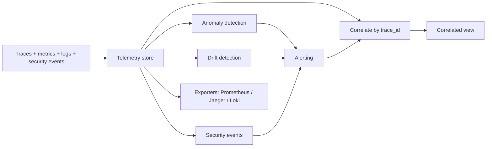

# Architecture

The platform ingests OpenTelemetry-shaped signals, detects, alerts, and
correlates — all keyed by trace id.

## The data model (`models.py`)

Traces, metrics, and logs use the OpenTelemetry vocabulary — trace/span ids, span
kind and status, metric instruments, log severity — so the exporters can emit
real backend payloads. A thin security layer adds security events and alerts, and
**every** security signal carries a `trace_id`. That single decision is what makes
correlation possible.

## Detection

- **Anomaly** (`anomaly.py`): the Iglewicz-Hoaglin modified z-score, built on the
  median and MAD so a single spike cannot inflate the baseline and hide itself.
  It survives a zero-MAD flat series without dividing by zero.
- **Drift** (`drift.py`): the Population Stability Index over Laplace-smoothed,
  sample-sized bins, so a slow behavioral shift is caught even when no point
  spikes — and empty bins on small samples do not blow up the log ratio.

## Alerting and correlation

`alerting.py` normalizes anomalies, drift, and security events into one `Alert`
type with a stable id (dedup) and a severity rank. `correlation.py` then gathers
every span, log, security event, metric, and alert sharing a trace id into one
`CorrelatedView` — the single pane an analyst reads instead of pivoting across
four tools.

## Exporters (`exporters.py`)

The same telemetry serializes to the Prometheus text exposition format, a Jaeger
trace document, and a Loki push payload — the exact shapes those backends accept.
The backends are not run here; the point is that the model is genuinely
OpenTelemetry, not a bespoke structure.

## Determinism

Ids are hashed from scenario names, metric baselines carry a fixed wiggle, and
detection is pure statistics. So the whole pipeline — down to trace and alert ids
— reproduces exactly, and the benchmark can hash "what correlated" into one stable
value.
